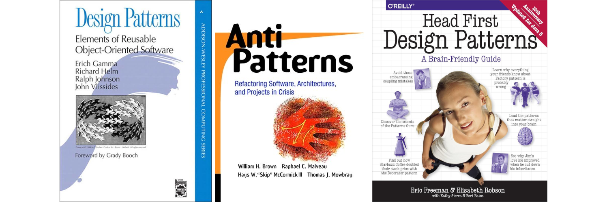
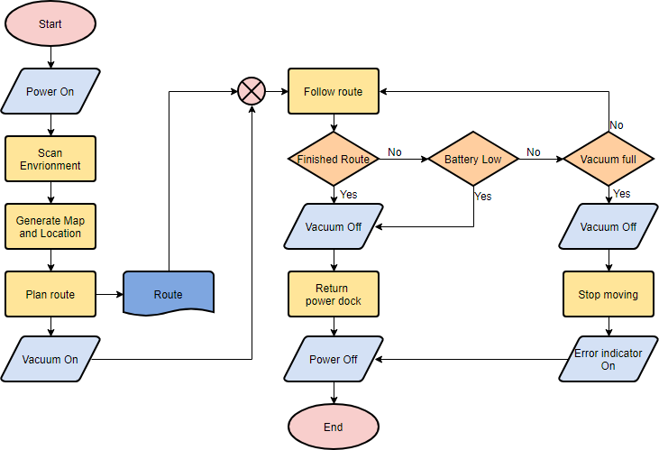
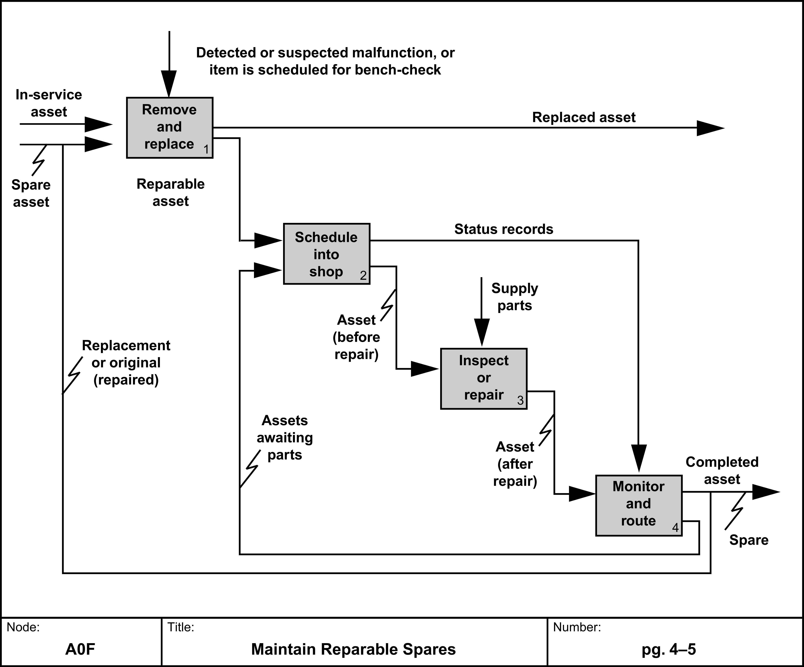
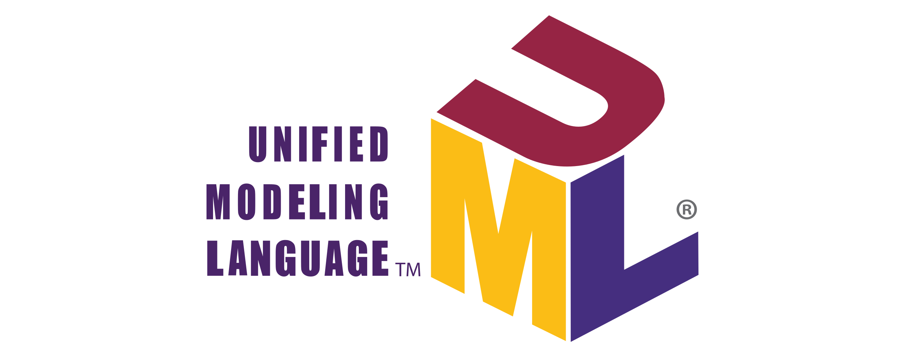
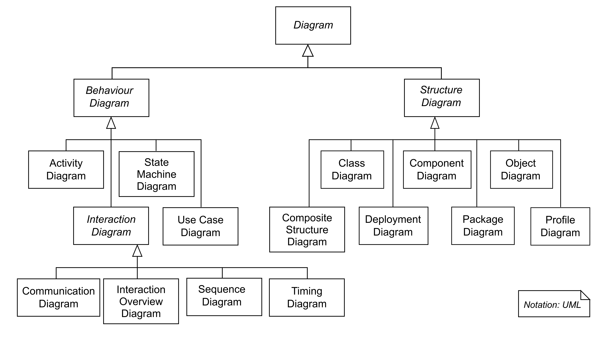

# Design Patterns

## What is a Design Pattern?
- Design patterns describe high quality practical solutions to recurring programming problems.
- **Design patterns don't require amazing programming tricks.**
- Design patterns are a toolbox of reusable solutions and best practices that have been refined over many years into a succinct format.
- Design patterns provide a vocabulary, or shorthand, that programmers can use when explaining complex software to each other.
- A particular design pattern may not be the best solution, but is a known good solution.
- Anti-patterns also exist. Anti-patterns are known bad solutions.

-----

## More on Requirements and Design

- How to document requirements and designs?
- There are several techniques/tools
    - Flowcharts
    - IDEF
    - UML
    - SysML
    - Documents

-----

## Flowcharts

- Widely used in the 1960's and 1970's (pre-CAD and other software tools)
- Still used today mainly to convey processes in presentations (there are predefined shapes in PowerPoint)
- Help visualize program flow
- Each shape has predefined meanings

-----

## IDEF

- IDEF - ICAM Definition for Functional Modeling
- ICAM - Integrated Computer Aided Manufacturing
- Modeling Language for the analysis, development, reengineering and integration of information systems, business processes or software engineering analysis. [[1]](https://en.wikipedia.org/wiki/IDEF)

### IDEF Diagram

-----

## UML - Unified Modeling Language

- UML is a general-purpose, developmental, modeling language in the field of software engineering that is a standard way to **visualize** the design of a system.

### UML Diagram

### Structure Diagrams
- Represent the static aspects of the system
- Used extensively in documenting the software architecture
- Component diagrams identify how the software system is split up into components and dependencies
- Class diagrams identify the classes and the methods and class variables

### Behavior Diagrams
- Represent the dynamic aspects of the system
- Emphasizes what must happen in the system being modeled
- Activity Diagrams
    - Similar to flowcharts
- Use-Case Diagrams
    - Show interactions between users and actions of the system
- Interaction Diagrams
    - Emphasize the flow of control and data among the things in the system being modeled
    - Sequence diagrams show how objects communicate with each other regarding the sequence of messages in the system
    - Communication diagrams show control between system objects

-----

## SysML

- System Modeling Language
- An extension of UML
- Used to support Model Based System Engineering (MBSE)
    - MBSE is the formalized application of modeling to support system requirements, design, analysis, verification, and validation activities beginning in the conceptual design phase and continuing throughout development and later life cycle phases. (INCOSE, System Engineering Vision 2020)

-----

## Requirements and Design

- Why use modeling languages and tools?
    - Visualize requirements and design (a picture is worth a thousand words)
    - Provides methodology/process for developers to follow in doing requirements and design
    - Documents requirements and designs using a common understanding of terms and diagrams
- Which modeling language should you use?
    - Pick the modeling language/technique that best shows your requirements and design
    - Some organizations/customers will dictate languages and tools to be used
- A common pitfall in modeling is the desire to model for the sake of modeling
- Modeling is a tool/method to elicit and document requirements and designs
- Electronic/Paper documents
    - Are sometimes still required by customers
    - Depending on the size and needs of a program, may be more efficient than using a tool
    - Provide the ability to use a variety of diagrams to document requirements and designs