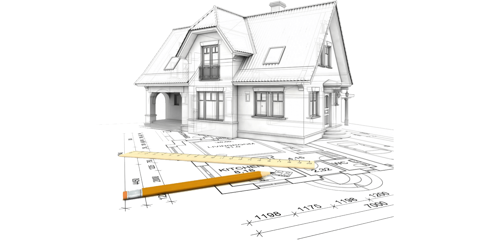

# Design

-----

## Top Down
- [https://en.wikipedia.org/wiki/Bottom–up_and_top–down_design](https://en.wikipedia.org/wiki/Bottom%E2%80%93up_and_top%E2%80%93down_design)
- Decompose problems into smaller problems until there is a 1:1 correspondence between sub-problems and modules or classes.
- Examples:
    - Outline a document before you write the content paragraphs
    - I need to build a model of the Millennium Falcon
        - The Falcon has engines, cargo bay, secret compartments, laser blaster turrets, bridge, crew gathering area, and lots of sparky droid and Wookie shocking things.
            - What LEGO block shapes do I need to build each subsystem?
            - There are a million ways to decompose a complex system. How do I know I have a good/best decomposition?

-----

## Bottom Up
- Piece together components into systems to give rise to more complex systems
- Examples:
    - Unix shell scripts using pipes
    - I need to build a model of the Millennium Falcon
        - I have a collection of LEGO blocks in different shapes, colors, and sizes
            - How can I assemble the LEGO blocks to models of Falcon subsystems and then integrate the subsystems?
            - Do I need any block shapes that I don't already have? How and when will I know?

-----

## Can you Design without Requirements?
- How do you know when you are done designing?
    - When the design describes HOW every requirement will be met
    - **_And_** the design is cohesive
    - Is this even possible without requirements?

-----

## How to Proceed
- Elicit requirements from the customer/user regardless of whether there is a formal requirements documentation or not.
    - Integrative, painful process
    - The customer depends on your expertise to define their requirements because the customer doesn't always have the necessary expertise
- You don't necessarily need to get all of the customer's needs noted up front.
    - You might miss some vital piece of information that renders your system architecture useless
    - Don't commit to a potentially incompatible architecture too early.
- Buy a crystal ball

-----

## Do Agile Teams Design?

-----

## Design Must Meet Requirements
- First and foremost, a design must meet requirements and/or solve a customer or user's problem.
- A working design is better than one that doesn't work.
- It may be necessary to prototype more than one design to enable comparisons.

-----

## Comparing Designs
- Given two or more designs that will meet requirements and/or solve the customer or user's problem, which design is better and why?
    - Simpler solutions are usually better
        - There are multiple dimensions of complexity starting with overall size
        - [Cyclomatic complexity](https://en.wikipedia.org/wiki/Cyclomatic_complexity)
    - Reusable solutions are usually better
        - Reusability is primarily achieved through loose coupling, Literate Programming, and Test Driven Development.
        - Some form of "reuse" library or repository is needed for reusable code to be found.

-----

## Example: Dependency Inversion
- [https://javatechonline.com/solid-principles-the-dependency-inversion-principle/](https://javatechonline.com/solid-principles-the-dependency-inversion-principle/)

-----

## Side Effect Free Programming
- It is possible
    - Variable free programming is possible
    - Use pass-by-value semantics
- It usually reduces coupling
- It may not be the most memory or computationally efficient
    - Copy-on-write may improve efficiency
    - Some C++ `std::string` implementations use copy-on-write

-----

## Software Design Axioms
- Avoid side effects
- Minimize Coupling
- Maximize Cohesion
- Encapsulate what varies
- Favor composition over inheritance
- Be Literate
- Document **_WHY_**
- Be able to test
- Provide traceability from requirements to design to implementation to test.