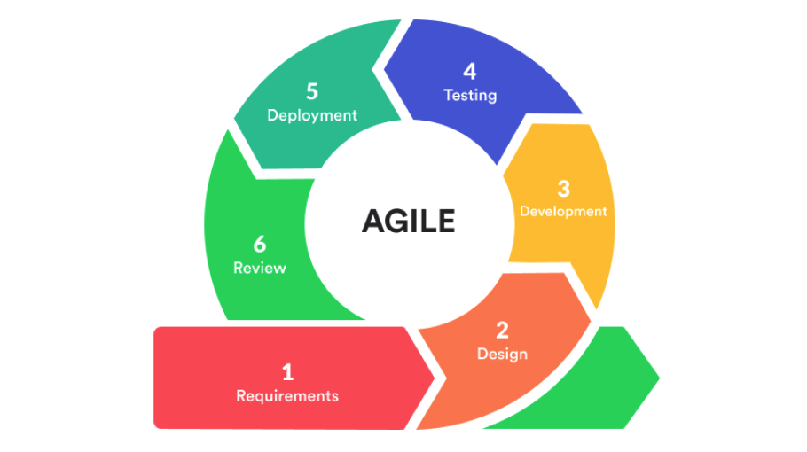

# Software Development Lifecycles
* Cogan Shimizu

## The Basics
**Engineering Processes (1/2)
* Engineering processes define approaches to problem-solving.
* An engineering process is a common series of steps that engineers follow to create functional products.
* A mature engineering process produces predictable results every time. For example, it is not acceptable for 1% of bridges projects to fail.

-----

**Engineering Processes (2/2)**
* Process alone does not assure success!
* Processes help assure a series of steps are performed and not skipped without due consideration.
* Processes need to be tailored to the program being executed.
* Process does not assure "Quality"
* The engineering work still needs to be performed!

## Waterfall Development

* organized into linear sequential phases, where each phase depends on the deliverables of the previous one and corresponds to a specialization of tasks
* waterfall development model originated in the manufacturing and construction industries (probably)

**Critiques**
* Clients may not know exactly what their requirements actually are
* Unanticipiated future difficulties (unknown unknowns)
* Meta-engineering explosion

## Agile Development
* Manifesto:
  * Individuals and interactions over processes and tools
  * Working software over comprehensive documentation
  * Customer collaboration over contract negotiation
  * Responding to change over following a plan

-----

* Obtain "User Stories" that describe what users want to achieve
  * A typically non-technical description in the user’s own words of what "Done" means.
  * User stories are translated into Product Backlog Items (PBI)
    * PBIs are itemized functional goals obtained from user stories
    * Each PBI has acceptance criteria that answers "How do we know when we are done?"
* Subdivide product development into "sprints", short duration increments of work that complete PBIs
* Achieve Minimum Viable Product (MVP) as soon as possible or "Fail Early"

-----

**Minimum Viable Product**
* The MVP is the first delivery to a users that meets one or more of the users’ needs
* Collaborate with users to refine the user story
* Users will have new ideas or provide clarifications when presented with something they can use
* If project is cancelled before completion, users at least have partial functionality that meets some of their needs

**Critiques (1/3)**
* [How to Detect ‘Agile BS’](https://thenewstack.io/the-u-s-department-of-defense-on-how-to-detect-agile-bs/)
  * Who are your users and how are you interacting with them?
  * What is your (current and future) cycle time for releases to your users?
  * What are your management metrics for development and operations?
  * What have you learned in your past three sprint cycles and what did you do about it? ("Wrong answers: ‘what’s a sprint cycle’…?")

-----

**Critiques (2/3)**
* "Agile was designed for experienced, smart, and high-achieving people like its creators, i.e. stars. You could give them any project, with any method, and they would succeed. Not every group can be motivated, experienced, and skilled enough to self-organize into an efficient team. We have to work with the staff we have. They need close supervision. So Agile is not for us."
* "Agile only works for small projects and our projects are big. Teams larger than eight are too big to be Agile. We are a large organization with large projects so Agile won’t work for us."
* "Most agile methodologies do not define any project management processes. Whether we’re agile or not, we need to manage project scope, planning, budgets, strategies, and reporting. So Agile can’t be the answer."
* "Here we go again. Another silver bullet! Another panacea! Another management fad!"

-----

**Critiques (3/3)**
* When will you be done? How much will it cost? Are you ahead or behind schedule?
* You mean we are going to ship half-baked product revisions every two weeks? It takes our customer a full day to install each product update! The customer doesn’t want to change that fast.
* Our customer doesn’t have an ability or interest for extensive collaboration and/or the customer is not the user.
* We don’t yet have any customers to give us user stories
  * Customers frequently don’t know what they want. “If I had asked people what they wanted, they would have said faster horses.” – Attributed to Henry Ford

## Spiral Development

-----

**The Cycle**
1. Consider the win conditions of all success-critical stakeholders.
2. Identify and evaluate alternative approaches for satisfying the win conditions.
3. Identify and resolve risks that stem from the selected approach(es).
4. Obtain approval from all success-critical stakeholders, plus commitment to pursue the next cycle.

* Project cycles that omit or shortchange any of these activities risk wasting effort by pursuing options that are unacceptable to key stakeholders, or are too risky.
* Some "hazardous spiral look-alike" processes violate this invariant by excluding key stakeholders from certain sequential phases or cycles. For example, system maintainers and administrators might not be invited to participate in definition and development of the system. As a result, the system is at risk of failing to satisfy their win conditions.

## Additional Resources
* [Agile Variants](https://www.inflectra.com/Solutions/Methodologies/Agile-Development.aspx)