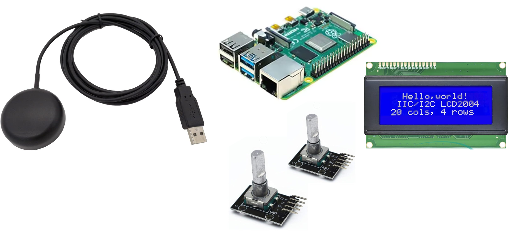

# User Stories
- Cogan Shimizu and Joey Sodergren

-----

## What is a User Story?
A concise, written description of a piece of functionality that will be valuable to a user (or owner) of the Software.

-----

## User Story Description

As a `[user role]` I want to `[goal]` so I can `[reason]`.

*For Example:*\
As a **registered user** I want to **log in** so I can **access subscriber-only content.**

-----

## How detailed should a User Story be?

Detailed enough for the team to start work from, and further details to be established and clarified
at the time of development.

-----

## User Story Checklist

- Keep them short
- Keep them simple
- Write from the perspective of the user
- Make the value/benefit of the story clear
    - What is the reason of the story?
- Write stories as a team
- Use acceptable criteria to show an MVP

-----

## Reference for creating Product Backlog of User Stories in GitHub

- Creating User Stories in GitHub
    - [https://youtu.be/m8ZxTHSKSKE](https://youtu.be/m8ZxTHSKSKE)
- Creating a Sprint Task Board
    - [https://youtu.be/Qasz5fhxIqE](https://youtu.be/Qasz5fhxIqE)
- Sprint Planning and Management
    - [https://youtu.be/-MBEnpAgmug](https://youtu.be/-MBEnpAgmug)

-----

## References for User Stories

- [Workshop - Writing Good User Stories](https://www.slideshare.net/slideshow/workshop-writing-good-user-stories/84596196)
- [Introducing Agile User Stories](https://www.slideshare.net/slideshow/introducing-agile-user-stories/3120695)

-----

## Further Description

### What are user stories:

- *A user story is an informal, general explanation, of a software feature written from the perspective of the end user. Its purpose is to articulate how a software feature will provide value to the customer.* [[1]](https://www.atlassian.com/agile/project-management/user-stories)
- It's tempting to think that user stories are, simply put, software system requirements. But they're not. [[1]](https://www.atlassian.com/agile/project-management/user-stories)
    - ***(Note: Software requirements flow from user stories.)***

### Examples of familiar user stories
- Rules for games:
    - Describe the user interface and interactions that users have with the game.
    - They don't describe the structure of the software or the behavior of the software.
    - User Story: "The player rolls the dice to see how many spaces to move forward through the game board. If the user rolls doubles, the double the value of the number on the dice. (Double 1's = 4, 2's = 8, 3's = 12, 4's = 16, 5's = 20, 6's = 24)"
        - Requirements derived from this user story:
            - The software shall provide a random number generator in the range from 1 to 6.
            - The software shall simulate two dice for each player's roll.
- GPS Location and Data Logger
    - Overview:
        - The system shall provide the ability to collect user location and satellite data as the user travels over the course of a day.
        - The system shall be able to upload the information once at a centralized location.
    - Equipment:
        - Laptop for development and offline analysis of collected data
        - Raspberry Pi, SD card
        - USB GPS receiver
        - 4x20 LCD Character Display
        - Ability to add switches and rotary encoder
    - Standalone Equipment:\
    
    - Concept of Operations (CONOPS)
        1. Driver powers on the unit
            - Driver waits for up to 5 minutes for system init
            - Once initialized, driver begins deliveries
            - Monitor after each delivery to see if it is still collecting data
        2. End of shift
            - Download the data
                - USB transfer cable
                - Wi-Fi
                - Bluetooth
            - Check for data validity
        3. Offline Activities (user at the laptop)
            - The user checks for the total number of stops
            - The user checks the average time the car was stopped
            - The user checks the distance travelled
    - User Stories
        - Upon power-on, the display will indicate "Waiting for GPS"
        - The driver monitors the screen for the "GPS is Ready" message.
        - Once the "GPS is Ready" is displayed the driver presses the OK button.
        - After 5 minutes from power-on, if GPS has not been acquired, display "GPS init problem"
        - The driver checks to see if data points are being incremented. "Data points = nnnnnn"
        - The driver checks to see if the displayed time is being updated.
    - Example Sprint Backlog
        - The software shall initialize the USB interface to read the GPS data.
        - The software shall initialize the 4x20 character display.
        - The system shall monitor the GPS RCVR online every second.
        - The system shall display "GPS is Ready" when receiver OK.
        - The system shall display "GPS is Offline" when not OK.
        - The system shall display the system time on the 4th line of the display.